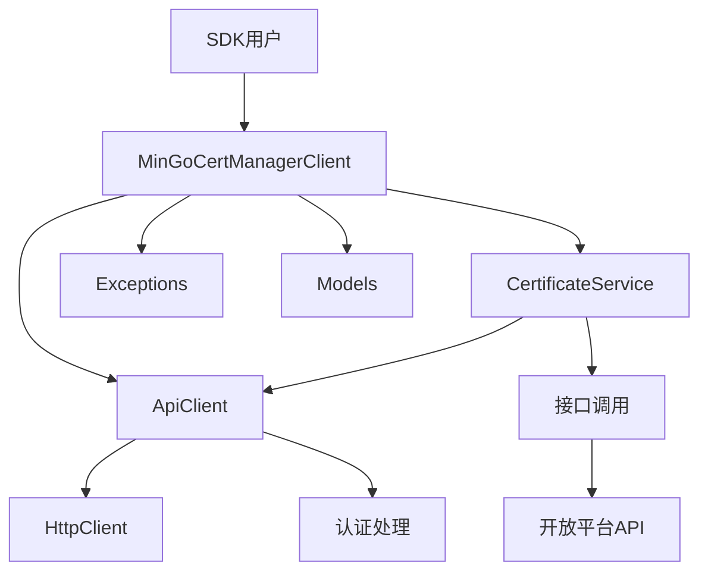

# SDK开发项目设计文档

## 整体架构



## 分层设计

### 1. 客户端层
- **MinGoCertManagerClient**：SDK的主入口，提供所有服务的访问点
- 负责初始化和管理各个服务
- 提供配置选项

### 2. 服务层
- **CertificateService**：封装证书相关的接口调用
- 提供申请证书和下载证书的方法

### 3. 通信层
- **ApiClient**：负责处理HTTP请求和响应
- 内部处理认证头的添加
- 处理响应的反序列化
- 处理错误和异常

### 4. 模型层
- **Models**：SDK特有的数据模型
- 包含请求和响应的模型

### 5. 异常层
- **Exceptions**：SDK特有的异常类
- 提供详细的错误信息

## 核心组件设计

### 1. MinGoCertManagerClient
- **构造函数**：接收API密钥和BaseUrl
- **属性**：CertificateService实例
- **方法**：无，主要作为服务的容器

### 2. ApiClient
- **构造函数**：接收HttpClient和API密钥
- **方法**：
  - `SendAsync<T>(HttpRequestMessage)`：发送HTTP请求并返回响应
  - `AddAuthHeader(HttpRequestMessage)`：添加认证头

### 3. CertificateService
- **构造函数**：接收ApiClient实例
- **方法**：
  - `RequestCertificateAsync(CertificateRequest request)`：申请新证书
  - `DownloadCertificateAsync(string domain, CertificateFormat format, string? password = null)`：下载证书

### 4. 模型
- **CertificateRequest**：证书申请请求模型
- **CertificateResponse**：证书申请响应模型
- **ErrorResponse**：错误响应模型

### 5. 异常
- **SdkException**：SDK基础异常
- **ApiException**：API调用异常
- **AuthenticationException**：认证异常

## 接口契约

### 1. 申请证书接口
- **URL**：`/api/external/certificates`
- **方法**：POST
- **请求体**：
  ```json
  {
    "Domain": "example.com",
    "IsWildcard": false,
    "UseStaging": false
  }
  ```
- **响应**：
  ```json
  {
    "Success": true,
    "CertificateId": "guid",
    "Domain": "example.com",
    "Status": "Active",
    "CreatedAt": "2023-01-01T00:00:00Z",
    "ExpiresAt": "2023-04-01T00:00:00Z"
  }
  ```

### 2. 下载证书接口
- **URL**：`/api/external/certificates/{domain}/download`
- **方法**：GET
- **查询参数**：
  - format：证书格式（Pfx、Pem、Crt）
  - password：证书密码（仅PFX格式需要）
- **响应**：证书文件二进制数据

## 数据流向

1. SDK用户调用CertificateService的方法
2. CertificateService构造请求并调用ApiClient
3. ApiClient添加认证头并发送HTTP请求
4. ApiClient接收响应并反序列化
5. ApiClient处理错误和异常
6. CertificateService返回结果给SDK用户

## 异常处理策略

1. **网络异常**：捕获HttpRequestException并转换为SdkException
2. **API错误**：根据响应中的Error字段创建ApiException
3. **认证错误**：当认证失败时创建AuthenticationException
4. **序列化异常**：捕获JsonException并转换为SdkException

## 依赖关系

- SDK项目依赖于Core项目（使用其中的实体和枚举）
- SDK项目不依赖于Web项目
- SDK项目使用System.Net.Http和System.Text.Json