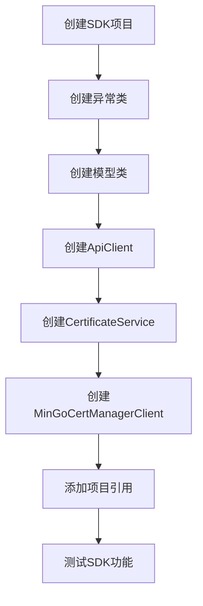

# SDK开发项目任务拆分

## 任务依赖图

## 原子任务拆分

### 1. 创建SDK项目
- **输入**：项目解决方案文件
- **输出**：MinGo.CertManager.SDK项目
- **实现约束**：
  - 使用.NET 10
  - 类库项目类型
  - 命名空间：MinGo.CertManager.SDK

### 2. 创建异常类
- **输入**：SDK项目
- **输出**：
  - SdkException.cs
  - ApiException.cs
  - AuthenticationException.cs
- **实现约束**：
  - 继承自Exception
  - 提供详细的错误信息
  - 包含必要的构造函数

### 3. 创建模型类
- **输入**：SDK项目
- **输出**：
  - CertificateRequest.cs
  - CertificateResponse.cs
  - ErrorResponse.cs
- **实现约束**：
  - 使用System.Text.Json序列化
  - 包含必要的属性
  - 与API接口对应

### 4. 创建ApiClient
- **输入**：SDK项目
- **输出**：ApiClient.cs
- **实现约束**：
  - 使用HttpClient
  - 处理认证头
  - 处理响应反序列化
  - 处理错误和异常

### 5. 创建CertificateService
- **输入**：SDK项目
- **输出**：CertificateService.cs
- **实现约束**：
  - 封装证书相关接口
  - 提供异步方法
  - 调用ApiClient

### 6. 创建MinGoCertManagerClient
- **输入**：SDK项目
- **输出**：MinGoCertManagerClient.cs
- **实现约束**：
  - 作为SDK的主入口
  - 提供服务实例
  - 支持配置选项

### 7. 添加项目引用
- **输入**：SDK项目
- **输出**：项目引用配置
- **实现约束**：
  - 引用Core项目
  - 不引用Web项目

### 8. 测试SDK功能
- **输入**：完整的SDK项目
- **输出**：测试结果
- **实现约束**：
  - 验证SDK能够正常编译
  - 验证认证处理
  - 验证接口调用

## 任务说明

### 任务1：创建SDK项目
1. 在解决方案中添加新的类库项目
2. 命名为MinGo.CertManager.SDK
3. 设置目标框架为.NET 10

### 任务2：创建异常类
1. 创建Exceptions文件夹
2. 创建SdkException基类
3. 创建ApiException和AuthenticationException派生类

### 任务3：创建模型类
1. 创建Models文件夹
2. 创建CertificateRequest模型
3. 创建CertificateResponse模型
4. 创建ErrorResponse模型

### 任务4：创建ApiClient
1. 创建ApiClient.cs文件
2. 实现构造函数，接收HttpClient和API密钥
3. 实现AddAuthHeader方法
4. 实现SendAsync方法
5. 实现错误处理逻辑

### 任务5：创建CertificateService
1. 创建Services文件夹
2. 创建CertificateService.cs文件
3. 实现构造函数，接收ApiClient
4. 实现RequestCertificateAsync方法
5. 实现DownloadCertificateAsync方法

### 任务6：创建MinGoCertManagerClient
1. 创建MinGoCertManagerClient.cs文件
2. 实现构造函数，接收API密钥和BaseUrl
3. 初始化ApiClient和CertificateService
4. 提供CertificateService属性

### 任务7：添加项目引用
1. 引用MinGo.CertManager.Core项目
2. 添加System.Net.Http和System.Text.Json包引用

### 任务8：测试SDK功能
1. 编译SDK项目
2. 验证项目能够正常编译
3. 检查代码结构是否符合设计文档